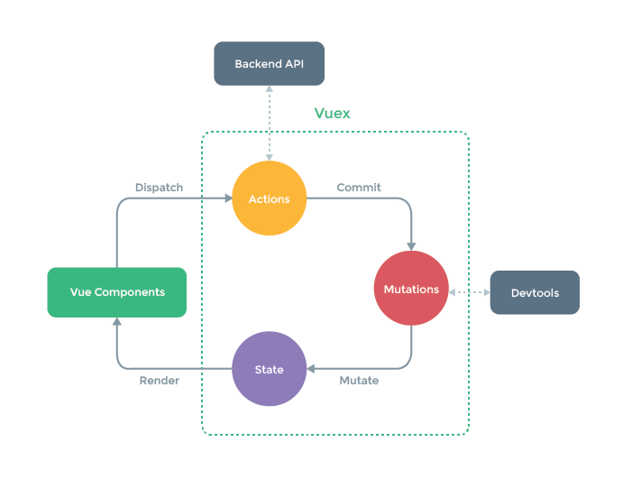

# 〇、准备工作

## 1、前导知识

- HTML
- CSS
- JavaScript
- ES6+
- Node.js

## 2、安装 Node.js

http://nodejs.cn/download/

## 3、安装 VSCode

https://code.visualstudio.com/

Volar 插件

## 4、安装 Git

https://git-scm.com/downloads

# 一、Vite2

《Vite2 学习指南》链接：

链接: https://pan.baidu.com/s/1Muhm19I4XFgo5hGkqiickQ 提取码: q0r1 


# 二、Vue3

## 1、搭建第一个Vite项目

>**兼容性注意**
>
>Vite 需要 [Node.js](https://nodejs.org/en/) 版本 >= 12.0.0。

```
npm init vite
```

运行完的结果如下：

```shell
felixlu 2206 $ npm init vite
Need to install the following packages:
  create-vite
Ok to proceed? (y) y
✔ Project name: … vue3-basics
? Select a framework: › - Use arrow-keys. Return to submit.
? Select a framework: › - Use arrow-keys. Return to submit.
? Select a framework: › - Use arrow-keys. Return to submit.
? Select a framework: › - Use arrow-keys. Return to submit.
? Select a framework: › - Use arrow-keys. Return to submit.
✔ Select a framework: › vue
✔ Select a variant: › vue

Scaffolding project in /Users/felixlu/Desktop/workspace/st-test/2206/vue3-basics...

Done. Now run:

  cd vue3-basics
  npm install
  npm run dev
```

vite.config.js

```js
import { defineConfig } from 'vite'
import vue from '@vitejs/plugin-vue'
import { resolve } from 'path'

// https://vitejs.dev/config/
export default defineConfig({
  plugins: [vue()],
  resolve: {
    alias: {
      '@': resolve(__dirname, './src')
    }
  }
})
```

## 2、编写第一个Vue3程序

```vue
<script setup>
  // 从 Vue 中导入 ref
  import { ref } from 'vue'

  // 定义一个响应式数据count
  const count = ref(0)

</script>

<template>
  <div>
    {{count}}
    <button @click="count++">add</button>
  </div>
</template>

<style lang="stylus">
  
</style>
```

## 3、模板语法

```vue
<script setup>
  import { ref, reactive } from 'vue'
  const msg = ref('qfnext')
  const rawHtml = ref('<h1>2022</h1>')
  const title = ref('千锋教育')
  const words = ref('hello vue3')
  const objectOfAttrs = reactive({
    id: 'container',
    class: 'wrapper'
  })
  const number = ref(100)
  const ok = ref(true)
  const isShow = ref(true)
  const handleKeyUp = (e) => {
    console.log(e.target.value)
  }
</script>

<template>
  <div>
    {{msg}}
  </div>
  <div v-html="rawHtml"></div>
  <div v-bind:title="title">qianfeng</div>
  <div :title="title">qianfeng edu</div>
  <div v-bind="objectOfAttrs">
    Vue3学习前导知识：HTML+CSS+JavaScript
  </div>
  <div>
    {{ number + 1 }}
    {{ ok ? 'YES' : 'NO' }}
    {{words.split('').reverse().join('')}}
  </div>
  <div v-if="isShow">
    Vue 指令
  </div>
  <div>
    <input type="text" v-on:keyup.enter="handleKeyUp">
  </div>
</template>

<style lang="css">
.wrapper {
  color: red
}
</style>
```


## 4、响应式基础

```vue
<script setup>
import { ref, reactive } from 'vue'

const state = reactive({ count: 0 })
const count = ref(0)

function increment() {
  state.count++
}

const add = () => {
  count.value++
}
</script>

<template>
  <button @click="increment">
    {{ state.count }}
  </button>
  <button @click="add">
    {{ count }}
  </button>
</template>
```

## 5、计算属性

```vue
<script setup>
  import { computed, reactive, onMounted } from 'vue'

  const cart = reactive({
    orderId: '001',
    products: [
      {
        name: 'iphone12',
        price: 6000,
        quantity: 3
      },
      {
        name: 'iphone13',
        price: 10000,
        quantity: 2
      },
      {
        name: 'iphone14',
        price: 12000,
        quantity: 4
      }
    ]
  })

  const totalPrice = computed(() => {
    console.log('totalPrice')
    return cart.products.reduce((total, product) => {
      total += product.price * product.quantity
      return total
    }, 0)
  })

  const culPrice = () => {
    console.log('culPrice')
    return cart.products.reduce((total, product) => {
      total += product.price * product.quantity
      return total
    }, 0)
  }

  onMounted(() => {
    setTimeout(() => {
      cart.products[0].price = 12000
    }, 2000)

    setTimeout(() => {
      cart.orderId = '002'
    }, 4000)
  })
</script>

<template>
  <div>
    {{cart.orderId}}
  </div>
  <div>
    {{totalPrice}}
  </div>
  <div>
    {{culPrice()}}
  </div>
</template>

<style lang="css">
  
</style>
```

## 6、Class 与 Style 绑定

```vue
<script setup>
  import { ref } from 'vue'
  const isActive = ref(true)
  const hasError = ref(true)
  const isBold = ref(false)
  const defaultClass = ref('text-default')

  const activeColor = ref('red')
  const fontSize = ref(30)
</script>

<template>
  <div
    class="static"
    :class="[{ 'bold': isBold }, defaultClass]"
  >
    hello
  </div>
  <div
    :class="{ active: isActive, 'text-danger': hasError }"
  >
    Vue3
  </div>
  <div :style="{ color: activeColor, fontSize: fontSize + 'px' }">
    !!!
  </div>
</template>

<style lang="css">
  .static {
    color: blue;
  }
  .active {
    font-size: 40px;
  }
  .text-danger {
    color: red;
  }
  .text-default {
    color: green
  }
  .bold {
    font-weight: bold;
  }
</style>
```

```vue
<script setup>
  import { ref } from 'vue'
  const list = ref(['line 1', 'line 2', 'line 3'])
  const curentIndex = ref(0)

  const handleClick = (index) => {
    curentIndex.value = index
  }
</script>

<template>
  <ul>
    <li 
      v-for="item, index in list"
      :class="{active: index === curentIndex}"
      @click="handleClick(index)"
    >
      {{item}}
    </li>
  </ul>
</template>

<style lang="css">
  .active {
    color: red;
    font-size: 30px;
  }
</style>
```

## 7、条件渲染

```vue
<script setup>
  import { ref } from 'vue'
  const isShow = ref(true)
  const toggle = () => {
    isShow.value = !isShow.value
  }
  
  const mark = ref(65)

  const ok = ref(false)
</script>

<template>
  <div>
    <span v-if="isShow">hello vue</span>
    <button @click="toggle">toggle</button>
  </div>

  <ul>
    <li v-if="mark >= 85">A</li>
    <li v-else-if="mark >= 60 && mark < 85">B</li>
    <li v-else>C</li>
  </ul>

  <template v-if="ok">
    <h1>Title</h1>
    <p>Paragraph 1</p>
    <p>Paragraph 2</p>
  </template>
</template>

<style lang="css">
  
</style>
```

## 8、列表渲染

```vue
<script setup>
  import { ref, reactive } from 'vue';
  const fruits = ref(['🍇', '🍌', '🍒', '🥔'])
  const course = reactive({
    title: 'Webpack5学习指南',
    author: '陆荣涛',
    publishDate: '2022-07-17'
  })
</script>

<template>
  <ul>
    <li v-for="fruit, index in fruits">
      {{index}} - {{fruit}}
    </li>
  </ul>

  <ul>
    <li v-for="c, k, i in course">
      {{i}} - {{k}}: {{c}}
    </li>
  </ul>

  <ul>
    <template v-for="fruit in fruits" >
      <li v-if="fruit!=='🥔'">
        {{fruit}}
      </li>
    </template>
  </ul>
</template>

<style lang="css">
  
</style>
```

## 9、事件处理

```vue
<script setup>
  import { ref } from 'vue'
  const name = ref('Vue.js')

  function greet(event) {
    console.log(`Hello ${name.value}!`)
    // `event` 是 DOM 原生事件
    if (event) {
      console.log(event.target.tagName)
    }
  }

  const changeName = () => {
    name.value = 'Hello Vue.js'
  }
</script>

<template>
  <div>
    {{name}}
    <button @click="greet($event), changeName()">Greet</button>
  </div>
</template>

<style lang="css">
  
</style>
```

## 10、表单输入绑定

```vue
<script setup>
  import { ref } from 'vue'
  const textValue = ref('')
  const textareaValue = ref('')
  const checked = ref(true)
  const checkedNames = ref([])
  const picked = ref('One')
  const selected = ref('A')
</script>

<template>
  <div>
    <p>{{ textValue }}</p>
    <input v-model="textValue" />
  </div>

  <div>
    <p style="white-space: pre-line;">{{textareaValue}}</p>
    <textarea v-model="textareaValue"></textarea>
  </div>

  <div>
    <input type="checkbox" id="checkbox" v-model="checked" />
    <label for="checkbox">{{ checked }}</label>
  </div>

  <div>
    <div>Checked names: {{ checkedNames }}</div>

    <input type="checkbox" id="jack" value="Jack" v-model="checkedNames">
    <label for="jack">Jack</label>

    <input type="checkbox" id="john" value="John" v-model="checkedNames">
    <label for="john">John</label>

    <input type="checkbox" id="mike" value="Mike" v-model="checkedNames">
    <label for="mike">Mike</label>
  </div>

  <div>
    <div>Picked: {{ picked }}</div>

    <input type="radio" id="one" value="One" v-model="picked" />
    <label for="one">One</label>

    <input type="radio" id="two" value="Two" v-model="picked" />
    <label for="two">Two</label>
  </div>

  <div>
    <div>Selected: {{ selected }}</div>

    <select v-model="selected" multiple>
      <option disabled value="">Please select one</option>
      <option>A</option>
      <option>B</option>
      <option>C</option>
    </select>
  </div>
</template>

<style lang="css">
  
</style>
```

## 11、生命周期


## 12、侦听器

```vue
<script setup>
  import { ref, watch, onMounted, watchEffect } from 'vue'

  const x = ref(0)
  const y = ref(0)

  // 单个 ref
  watch(x, (newX) => {
    console.log(`x is ${newX}`)
  })

  // getter 函数
  watch(
    () => x.value + y.value,
    (sum) => {
      console.log(`sum of x + y is: ${sum}`)
    }
  )

  // 多个来源组成的数组
  watch([x, () => y.value], ([newX, newY]) => {
    console.log(`x is ${newX} and y is ${newY}`)
  })

  onMounted(() => {
    x.value = 100
    url.value = 'https://yesno.wtf/api'
  })


  const url = ref('')
  const data = ref(null)

  async function fetchData() {
    const response = await fetch(url.value)
    data.value = await response.json()
    console.log(data.value)
  }

  // 立即获取
  // fetchData()
  // ...再侦听 url 变化
  watch(url, fetchData)

  /* watchEffect(async () => {
    const response = await fetch(url.value)
    data.value = await response.json()
    console.log(data.value)
  }) */
</script>

<template>
  <div>
    
  </div>
</template>

<style lang="css">
  
</style>
```

`watch` 和 `watchEffect` 都能响应式地执行有副作用的回调。它们之间的主要区别是追踪响应式依赖的方式：

- `watch` 只追踪明确侦听的源。它不会追踪任何在回调中访问到的东西。另外，仅在响应源确实改变时才会触发回调。`watch` 会避免在发生副作用时追踪依赖，因此，我们能更加精确地控制回调函数的触发时机。
- `watchEffect`，则会在副作用发生期间追踪依赖。它会在同步执行过程中，自动追踪所有能访问到的响应式 property。这更方便，而且代码往往更简洁，但其响应性依赖关系不那么明确。

## 13、组件注册

组件允许我们将 UI 划分为独立的、可重用的部分来思考。组件在应用程序中常常被组织成层层嵌套的树状结构：


这和我们嵌套 HTML 元素的方式类似，Vue 实现了自己的组件数据模型，使我们可以在每个组件内封装自定义内容与逻辑。Vue 同样也能很好地配合原生 Web Component。

```vue
// MyComponent.vue
<script setup>
  
</script>

<template>
  <div>
    我是一个全局的组件
  </div>
</template>

<style lang="css">
  
</style>
```

```js
// main.js
import { createApp } from 'vue'
import App from './App.vue'
import MyComponent from './views/11-component-registration/MyComponent.vue'

const app = createApp(App)
app.component('MyComponent', MyComponent)
app.mount('#app')
```

```vue
// Child.vue
<script setup>
  
</script>

<template>
  <div>
    我是一个局部的组件
  </div>
</template>

<style lang="css">
  
</style>
```

```vue
// Demo.vue
<script setup>
  import Child from './Child.vue'
</script>

<template>
  <div>
    <MyComponent></MyComponent>
    <Child></Child>
  </div>
</template>

<style lang="css">
  
</style>
```

## 14、Props

```vue
// Demo.vue
<script setup>
  import { onMounted, ref } from 'vue'
  import Child from './Child.vue'

  const title = ref('hello')
  onMounted(() => {
    setTimeout(() => {
      title.value = 'world'
    }, 2000)
  })
</script>

<template>
  <div>
    <Child :title="title"></Child>
  </div>
</template>

<style lang="css">
  
</style>

```

```vue
// Child.vue
<script setup>
  import { toRef, watchEffect } from 'vue'
  // defineProps(['title'])
  const props = defineProps({
    title: String
  })
  
  const myTitle = toRef(props, 'title')
  watchEffect(() => {
    console.log(myTitle.value)
  })
</script>

<template>
  <div>
    {{title}} child
  </div>
</template>

<style lang="css">
  
</style>
```

## 15、事件

```vue
// Demo.vue
<script setup>
  import { ref } from 'vue'
  import Child from './Child.vue'

  const title = ref('')
  const number = ref(0)

  const handleTitle = (msg) => {
    title.value = msg.value
  }
</script>

<template>
  <div>
    {{title}} {{number}}
    <Child @title-event="handleTitle" v-model:number-event="number"></Child>
  </div>
</template>

<style lang="css">
  
</style>
```

```vue
// Child.vue
<script setup>
  import { onMounted, ref } from 'vue'
  const title = ref('hello')

  // const emit = defineEmits(['on-title'])
  const emit = defineEmits(['title-event', 'update:number-event'])

  onMounted(() => {
    emit('title-event', title)
    emit('update:number-event', 100)
  })
</script>

<template>
  <div>
    child
  </div>
</template>

<style lang="css">
  
</style>
```

## 16、透传 Attribute

```vue
// Demo.vue
<script setup>
  import Child from './Child.vue'
</script>

<template>
  <div>
    <Child title="hello" class="a"></Child>
  </div>
</template>

<style lang="css">
  
</style>
```

```vue
// Child.vue
<script>
// 使用普通的 <script> 来声明选项
export default {
  inheritAttrs: false
}
</script>
<script setup>
  import { useAttrs } from 'vue'
  // defineProps(['title', 'class'])
  const attrs = useAttrs()
  console.log(attrs.class)
</script>

<template>
  <div>
    child
  </div>
</template>

<style lang="css">
  
</style>
```

## 17、插槽

- 插槽内容

```html
<todo-button>
  Add todo
</todo-button>
```

```html
<!-- todo-button 组件模板 -->
<button class="btn-primary">
  <slot></slot>
</button>
```

- 渲染作用域


- 备用内容

  有时为一个插槽指定备用 (也就是默认的) 内容是很有用的，它只会在没有提供内容的时候被渲染。

```html
<button type="submit">
  <slot>Submit</slot>
</button>
```

- 具名插槽

```html
<div class="container">
  <header>
    <slot name="header"></slot>
  </header>
  <main>
    <slot></slot>
  </main>
  <footer>
    <slot name="footer"></slot>
  </footer>
</div>
```

一个不带 `name` 的 `<slot>` 出口会带有隐含的名字“default”。

在向具名插槽提供内容的时候，我们可以在一个 `<template>` 元素上使用 `v-slot` 指令，并以 `v-slot` 的参数的形式提供其名称：

```html
<base-layout>
  <template v-slot:header>
    <h1>Here might be a page title</h1>
  </template>

  <template v-slot:default>
    <p>A paragraph for the main content.</p>
    <p>And another one.</p>
  </template>

  <template v-slot:footer>
    <p>Here's some contact info</p>
  </template>
</base-layout>
```

- 作用域插槽

有时让插槽内容能够访问子组件中才有的数据是很有用的。当一个组件被用来渲染一个项目数组时，这是一个常见的情况，我们希望能够自定义每个项目的渲染方式。

```js
app.component('todo-list', {
  data() {
    return {
      items: ['Feed a cat', 'Buy milk']
    }
  },
  template: `
    <ul>
      <li v-for="( item, index ) in items">
        <slot :item="item"></slot>
      </li>
    </ul>
  `
})
```

```html
<todo-list>
  <template v-slot:default="slotProps">
    <i class="fas fa-check"></i>
    <span class="green">{{ slotProps.item }}</span>
  </template>
</todo-list>
```

插槽综合例子：

```vue
// Demo.vue
<script setup>
  import { ref } from 'vue'
  import Child from './Child.vue'
  const info = ref('parent info')
</script>

<template>
  <div>
    <Child>
      <div>{{info}}</div>
      <template v-slot:header>
        <h1>
          标题
        </h1>
      </template>
      <template v-slot:body="{ msg1, msg2 }">
        <h2>{{msg1}}</h2>
        <h3>{{msg2}}</h3>
      </template>
    </Child>
  </div>
</template>

<style lang="css">
  
</style>
```

```vue
// Child.vue
<script setup>
  import { ref } from 'vue'
  const msg1 = ref('aaa')
  const msg2 = ref('bbb')
</script>

<template>
  <div>
    <slot></slot>
    <slot name="header"></slot>
    <slot name="body" msg1="msg1" msg2="msg2">
      内容
    </slot>
  </div>
</template>

<style lang="css">
  
</style>
```

## 18、依赖注入

```vue
<!-- 在 provider 组件内 -->
<script setup>
import { provide, ref } from 'vue'

const location = ref('North Pole')

function updateLocation() {
  location.value = 'South Pole'
}

provide('location', {
  location,
  updateLocation
})
</script>
```

```vue
<!-- 在 injector 组件 -->
<script setup>
import { inject } from 'vue'

const { location, updateLocation } = inject('location')
</script>

<template>
  <button @click="updateLocation">{{ location }}</button>
</template>
```

## 19、组合式函数

- 什么是组合式API


- 举一个例子

## 20、自定义指令和插件

**@/components/03-instance/FocusDirective.vue**

```js
// FocusDirective.js
export default {
  mounted(el) {
    el.focus()
  }
}
```

**@/components/03-instance/localePlugin.js**

```js
// localePlugin.js
export default {
  install(app, options) {
    app.mixin({
      created() {
        console.log('组件创建了！')
      }
    })
    
    app.component('global-component', GlobalComponent)
  }
}
```


# 三、VueRouter4

```js
// 1. 定义路由组件.
// 也可以从其他文件导入
const Home = { template: '<div>Home</div>' }
const About = { template: '<div>About</div>' }

// 2. 定义一些路由
// 每个路由都需要映射到一个组件。
// 我们后面再讨论嵌套路由。
const routes = [
  { path: '/', component: Home },
  { path: '/about', component: About },
]

// 3. 创建路由实例并传递 `routes` 配置
// 你可以在这里输入更多的配置，但我们在这里
// 暂时保持简单
const router = VueRouter.createRouter({
  // 4. 内部提供了 history 模式的实现。为了简单起见，我们在这里使用 hash 模式。
  history: VueRouter.createWebHashHistory(),
  routes, // `routes: routes` 的缩写
})

// 5. 创建并挂载根实例
const app = Vue.createApp({})
//确保 _use_ 路由实例使
//整个应用支持路由。
app.use(router)

app.mount('#app')

// 现在，应用已经启动了！
```


# 四、Pinia2




pinia 中文文档：https://pinia.web3doc.top/

## 1、简单例子

```js
import { createPinia } from 'pinia'
app.use(createPinia())
```


```js
// stores/counterStore.js
import { defineStore } from 'pinia'

// defineStore 函数返回值本质是一个Hooks
export const useCounterStore = defineStore('counter', {
  state: () => ({
    count: 0
  }),

  actions: {
    increment() {
      this.count++
      // console.log(0)
    }
  },

  getters: {
    doubleCount() {
      return this.count*2
    }
  }
})
export const counterStore = useCounterStore()
```

 ```vue
<script setup>
  import { storeToRefs } from 'pinia'
  import { counterStore } from '@/stores/counterStore'
  // const couterStore = useCounterStore()
  const { count, doubleCount } = storeToRefs(counterStore)
</script>

<template>
  <div>
    {{ count }} 
    {{ doubleCount }}
    <button @click="couterStore.increment">+</button>
  </div>
</template>

<style lang="css">
/* css 代码 */
</style>
 ```

## 2、购物车案例

```js
// data/api.js
function catchDataApi() {
  return new Promise((resolve, reject) => {
    setTimeout(() => {
      resolve([
        {
          id: 1,
          name: 'iphone12',
          price: 3000,
          inventory: 3
        },
        {
          id: 2,
          name: 'iphone13',
          price: 8000,
          inventory: 3
        },
        {
          id: 3,
          name: 'iphone14',
          price: 13000,
          inventory: 2
        }
      ])
    }, 1000)
  })
}

export default catchDataApi
```

```js
// store/productStore.js
import { defineStore } from 'pinia'
import catchDataApi from '../data/api'

export const useProductStore = defineStore({
  id: 'productStore',

  state: () => ({
    products: []
  }),

  actions: {
    async loadData() {
      try {
        const data = await catchDataApi()
        this.products = data
      } catch (error) {

      }
    }
  }
})
```

```js
// store/cartStore.js
import { defineStore, storeToRefs } from 'pinia'
import { useProductStore } from './productStore'
export const useCartStore = defineStore({
  id: 'cartStore',

  state: () => ({
    cartList: []
  }),

  // cartList = [
  //   {
  //     id: 1,
  //     name: 'iphone12',
  //     price: 10000,
  //     quantity: 1
  //   }
  // ]

  actions: {
    addToCart(product) {
      // 在购物车里查找是否有这个商品
      const p = this.cartList.find((item) => {
        return item.id === product.id
      })

      // 如果找到了，购物车里的这个商品的数量加 1
      // 如果没有没有找到，添加这个商品到购物车
      if (!!p) {
        p.quantity++
      } else {
        this.cartList.push({
          ...product,
          quantity: 1
        })
      }

      // 当点击放入购物车，这个商品的库存需要减少一个
      const productStore = useProductStore()
      const { products } = storeToRefs(productStore)
      const p2 = products.value.find((item) => {
        return item.id === product.id
      })
      p2.inventory--
    }
  },

  getters: {
    totalPrice() {
      return this.cartList.reduce((sum, item) => {
        return sum + item.price * item.quantity
      }, 0)
    }
  }
})
```

```vue
// views/Product.vue
<script setup>
import { storeToRefs } from 'pinia'
import { useProductStore } from '@/stores/productStore'
import { useCartStore } from '@/stores/cartStore'
const productStore = useProductStore()
const cartStore = useCartStore()
const { products } = storeToRefs(productStore)
const { addToCart } = cartStore
productStore.loadData()
</script>

<template>
  <h1>产品列表</h1>
  <hr>
  <ul>
    <li
      v-for="product in products"
    >
      {{product.name}} - ￥{{product.price}}
      <button 
        @click="addToCart(product)"
        :disabled="product.inventory <= 0"
      >放入购物车</button>
    </li>
  </ul>
</template>

<style lang="css">
/* css 代码 */
</style>
```

```vue
// views/Cart.vue
<script setup>
import { storeToRefs } from 'pinia'
import { useCartStore } from '@/stores/cartStore'
const cartStore = useCartStore()
const { cartList, totalPrice } = storeToRefs(cartStore)
</script>

<template>
  <h1>购物车</h1>
  <hr>
  <ul>
    <li v-for="product in cartList">
      {{product.name}} : {{product.quantity}} x ￥{{product.price}} = ￥{{product.quantity * product.price}}
    </li>
  </ul>
  <div>
    总价：￥{{totalPrice}}
  </div>
</template>

<style lang="css">
/* css 代码 */
</style>
```

```vue
// App.vue
<script setup>
import Product from '@/views/Product.vue'
import Cart from '@/views/Cart.vue'
</script>

<template>
  <Product></Product>
  <Cart></Cart>
</template>

<style lang="css">
/* css 代码 */
</style>
```


# 五、Electron 19

## 1、什么是 Electron

参见 PPT。

## 2、Electron 初探

### 2.1 常见的桌面GUI工具介绍

| 名称     | 语音   | 优点                     | 缺点                     |
| -------- | ------ | ------------------------ | ------------------------ |
| QT       | C++    | 跨平台、性能好、生态好   | 依赖多，程序包大         |
| PyQT     | Python | 底层集成度高、易上手     | 授权问题                 |
| WPF      | C#     | 类库丰富、扩展灵活       | 只支持Windows，程序包大  |
| WinForm  | C#     | 性能好，组件丰富，易上手 | 只支持Windows，UI差      |
| Swing    | Java   | 基于AWT，组件丰富        | 性能差，UI一般           |
| NW.js    | JS     | 跨平台性好，界面美观     | 底层交互差、性能差，包大 |
| Electron | JS     | 相比NW发展更好           | 底层交互差、性能差，包大 |
| CEF      | C++    | 性能好，灵活集成，UI美观 | 占用资源多，包大         |

- 底层依赖 + 调用：CEF、QT、Swing
- UI美观：Electron（NW.js）、PyQT
- 跨平台：Swing（JAVA）、PyQT（Python、C++）、Electron（前端）

技术是为业务服务的，选择合适的最重要！

### 2.2 桌面端设计与开发要点

1、UX/UI设计概念

**UX设计：**UX（User Experience）即用户体验，其核心是用户，体验指用户在使用产品以及与产品发生交互时出现的主观感受和需求满足。

**UI设计：**UI（User Interface）使用者界面，可以说是 UX 设计的一部分，其中重要的**图形化或者可视化**部分，都是由 UI 设计来完成的。

2、核心原则

简单易用。

3、通用原则

交互简单：上手就会，一看就懂

风格统一：菜单、导航、按钮反馈、颜色、预知提示

认知一致：名词、友好提示、划分信息、突出展示

4、桌面端设计

保持与PC端统一的风格设计与交互设计。

加入定制的菜单与专业操控设计。

减少资源加载。

### 2.3 初始化项目 + 项目依赖介绍

1、Electron 官网

https://www.electronjs.org/

2、初始化一个项目

```
felixlu electron $ npm init -y
```

```
npm i electron -D
```

3、配置启动脚本

在 package.json 里配置 npm 脚本：

```json
{
  "scripts": {
    "start": "electron ."
  },
}
```

4、创建入口文件

- 在项目根目录下创建文件 index.html：

```html
<!DOCTYPE html>
<html lang="en">
<head>
  <meta charset="UTF-8">
  <meta http-equiv="X-UA-Compatible" content="IE=edge">
  <meta name="viewport" content="width=device-width, initial-scale=1.0">
  <title>Electron Demo</title>
</head>
<body>
  hello Electron
</body>
</html>
```

- 在项目根目录下创建 index.js 文件，这是程序的入口文件：

```js
const { app } = require('electron')

// 主进程
const createWindow = () => {
  const win = new BrowserWindow({
    width: 800,
    height: 600
  })

  win.loadFile('index.html')
}

app.whenReady().then(createWindow)
```


## 3、Electron 核心概念

### 3.1 Electron 主进程与渲染进程

**主进程：**启动项目时运行的 main.js 脚本就是我们说的主进程。在主进程运行的脚本可以以创建 Web 页面的形式展示 GUI。**主进程只有一个**。

**渲染进程：**每个 Electron 的页面都在运行着自己的进程，这样的进程称之为渲染进程（基于Chromium的多进程结构）。


主进程使用 BrowserWindow 创建实例，主进程销毁后，对应的渲染进程回被终止。主进程与渲染进程通过 IPC 方式（事件驱动）进行通信。

### 3.2 主进程事件生命周期

> main process modules/app/event：https://www.electronjs.org/zh/docs/latest/api/app

```js
app.on('window-all-closed', () => {
  console.log('window-all-closed')
  // 对于 MacOS 系统 -> 关闭窗口时，不会直接推出应用
  if (process.platform !== 'darwin') {
    app.quit()
  }
})

app.on('quit', () => {
  console.log('quit')
})

app.whenReady().then(() => {
  createWindow()
  // 在MacOS下，当全部窗口关闭，点击 dock 图标，窗口再次打开。
  app.on('activate', () => {
    if (BrowserWindow.getAllWindows().length === 0) {
      createWindow()
    }
  })
})
```

### 3.3 渲染进程如何使用 Node 模块

**1、通过 webPreferences/nodeIntegration**

```js
const win = new BrowserWindow({
  width: 800,
  height: 400,
  webPreferences: {
  	nodeIntegration: true,
  	contextIsolation: false
  }
})
```

```html
<!DOCTYPE html>
<html lang="en">
<head>
  <meta charset="UTF-8">
  <meta http-equiv="X-UA-Compatible" content="IE=edge">
  <meta name="viewport" content="width=device-width, initial-scale=1.0">
  <title>Electron Demo</title>
  <script src="https://unpkg.com/vue@next"></script>
</head>
<body>
  <h1>
    hello Electron
  </h1>
  <div id="root">
    <p>electronVersion: {{electronVersion}}</p>
    <p>nodeVersion: {{nodeVersion}}</p>
    <p>chromeVersion: {{chromeVersion}}</p>
  </div>
  <script>
    // const path = require('path')
    // console.log(path)
    const app = Vue.createApp({
      data() {
        return {
          electronVersion: process.versions.electron,
          nodeVersion: process.versions.node,
          chromeVersion: process.versions.chrome
        }
      }
    })
    app.mount('#root')
  </script>
</body>
</html>
```

**2、通过 webPreferences/preload 实现**

```js
const win = new BrowserWindow({
    width: 800,
    height: 400,
    webPreferences: {
      // 在启动应用时在渲染进程里预加载 js
      preload: path.join(__dirname, './preload-js/index.js')
    }
  })
```

```js
// preload-js/index.js

// const { contextBridge } = require('electron')
// contextBridge.exposeInMainWorld('myAPI', {
//  desktop: true
// })

const { createApp } = require('vue')
window.addEventListener('load', () => {
  const app = createApp({
    data() {
      return {
        electronVersion: process.versions.electron,
        nodeVersion: process.versions.node,
        chromeVersion: process.versions.chrome
      }
    }
  })
  app.mount('#root')
})
```

**3、代码改造**

```js
// index.js
 win.loadFile('./renderer/index.html')
```

```html
<!-- renderer/index.html -->
<!DOCTYPE html>
<html lang="en">
<head>
  <meta charset="UTF-8">
  <meta http-equiv="X-UA-Compatible" content="IE=edge">
  <meta name="viewport" content="width=device-width, initial-scale=1.0">
  <!-- <meta http-equiv="Content-Security-Policy" content="script-src 'self';"> -->
  <title>Electron Demo</title>
  <script src="./vue.global.js"></script>
</head>
<body>
  <h1>hello Electron</h1>
  <div id="root"></div>
  <script src="./main.js"></script>
</body>
</html>
```

```js
// renderer/main.js
const app = Vue.createApp({
  template: `
    <p>electronVersion: {{electronVersion}}</p>
    <p>nodeVersion: {{nodeVersion}}</p>
    <p>chromeVersion: {{chromeVersion}}</p>
  `,
  data() {
    return {
      electronVersion: process.versions.electron,
      nodeVersion: process.versions.node,
      chromeVersion: process.versions.chrome
    }
  }
})
app.mount('#root')
```

```html
<!-- 配置CSP -->
<meta http-equiv="Content-Security-Policy" content="default-src 'self'; img-src 'self' data:; script-src 'self'; style-src 'self' 'unsafe-inline'">
```

```js
// 暂时关闭安全警告
process.env['ELECTRON_DISABLE_SECURITY_WARNINGS'] = 'true'
```

### 3.5 主进程与渲染进程通信

#### 3.5.1 index.html

```html
<!DOCTYPE html>
<html>
  <head>
    <meta charset="UTF-8">
    <meta http-equiv="Content-Security-Policy" content="script-src 'self' 'unsafe-inline'">
    <title>Hello World!</title>
  </head>
  <body>
    <h1>Hello World!</h1>

    <button type="button" id="talk">Talk to main process</button><br>

    <!-- All of the Node.js APIs are available in this renderer process. -->
    We are using Node.js <strong><script>document.write( process.versions.node)</script></strong>,
    and Electron <strong><script>document.write( process.versions.electron )</script></strong>.

    <script>
      // You can also require other files to run in this process
      require('./renderer.js')
    </script>
  </body>
</html>
```

#### 3.5.2 renderer.js

```js
// This file is required by the index.html file and will
// be executed in the renderer process for that window.
// All of the Node.js APIs are available in this process.

const { ipcRenderer } = require('electron')

let i = 1
setInterval( () => {
  console.log(i)
  i++
}, 1000)

document.getElementById('talk').addEventListener('click', e => {

  // ipcRenderer.send( 'channel1', 'Hello from main window')

  let response = ipcRenderer.sendSync( 'sync-message', 'Waiting for response')
  console.log(response)

})

ipcRenderer.on( 'channel1-response', (e, args) => {
  console.log(args)
})

ipcRenderer.on( 'mailbox', (e, args) => {
  console.log(args)
})
```

#### 3.5.3 main.js

```js
// Modules
const {app, BrowserWindow, ipcMain} = require('electron')

// Keep a global reference of the window object, if you don't, the window will
// be closed automatically when the JavaScript object is garbage collected.
let mainWindow

// Create a new BrowserWindow when `app` is ready
function createWindow () {

  mainWindow = new BrowserWindow({
    width: 1000, height: 800, x: 100, y:140,
    webPreferences: { nodeIntegration: true }
  })

  // Load index.html into the new BrowserWindow
  mainWindow.loadFile('index.html')

  // Open DevTools - Remove for PRODUCTION!
  mainWindow.webContents.openDevTools();

  mainWindow.webContents.on( 'did-finish-load', e => {

    // mainWindow.webContents.send( 'mailbox', {
    //   from: 'Ray',
    //   email: 'ray@stackacademy.tv',
    //   priority: 1
    // })
  })

  // Listen for window being closed
  mainWindow.on('closed',  () => {
    mainWindow = null
  })
}

ipcMain.on( 'sync-message', (e, args) => {
  console.log(args)

  setTimeout( () => {
    e.returnValue = 'A sync response from the main process'
  }, 4000)

})

ipcMain.on( 'channel1', (e, args) => {
  console.log(args)
  e.sender.send( 'channel1-response', 'Message received on "channel1". Thank you!')
})

// Electron `app` is ready
app.on('ready', createWindow)

// Quit when all windows are closed - (Not macOS - Darwin)
app.on('window-all-closed', () => {
  if (process.platform !== 'darwin') app.quit()
})

// When app icon is clicked and app is running, (macOS) recreate the BrowserWindow
app.on('activate', () => {
  if (mainWindow === null) createWindow()
})
```

## 4、主进程

> Electron API （Electron API 有两种）

- Main Process （主进进程）
- Renderer Process（渲染进程）

### 4.1 App

#### 4.1.1 事件

##### 4.1.1.1 before-quit

> 在应用程序开始关闭窗口之前触发。

```js
app.on('before-quit', (e) => {
  console.log('App is quiting')
  e.preventDefault()
})
```

##### 4.1.1.2 browser-window-blur

> 在 browserWindow 失去焦点时发出

```js
app.on('browser-window-blur', (e) => {
  console.log('App unfocused')
})
```

##### 4.1.1.3 browser-window-focus

> 在 browserWindow 获得焦点时发出

```js
app.on('browser-window-focus', (e) => {
  console.log('App focused')
})
```

#### 4.1.2 方法

##### 4.1.2.1 app.quit()

```js
app.on('browser-window-blur', (e) => {
  setTimeout(() => {
    app.quit()
  }, 3000)
})

app.on('browser-window-blur', (e) => {
  setTimeout(app.quit, 3000)
})
```

##### 4.1.2.2 app.getPath(name)

```js
app.whenReady().then(() => {
  console.log(app.getPath('desktop'))
  console.log(app.getPath('music'))
  console.log(app.getPath('temp'))
  console.log(app.getPath('userData'))

  createWindow()
})
```

### 4.2 BrowserWindow

> electron.BrowserWindow: 创建和控制浏览器窗口

#### 4.2.1 实例方法

win.loadURL(url[, options]): 和 loadFile 互斥

```js
mainWindow.loadURL('https://www.baidu.com')
```

#### 4.2.2 优雅的显示窗口

- 使用ready-to-show事件

```js
let mainWindow = new BrowserWindow({ show: false })
mainWindow.once('ready-to-show', () => {
  mainWindow.show()
})
```

- 设置 backgroundColor

```js
let win = new BrowserWindow({ backgroundColor: '#2e2c29' })
```

#### 4.2.3 父子窗口

- 窗口定义

```js
secondaryWindow = new BrowserWindow({
  width: 600,
  height: 600,
  webPreferences: { nodeIntegration: true }
})

secondaryWindow.loadFile('index.html')

secondaryWindow.on('closed',  () => {
   mainWindow = null
})
```

- 窗口关系

```js
secondaryWindow = new BrowserWindow({
  parent: mainWindon, // 定义父窗口
  modal: true // 锁定在主窗口
})
```

- 子窗口显示和隐藏

```js
secondaryWindow = new BrowserWindow({
  show: false
})

setTimeout(() => {
  secondaryWindow.show()
  setTimeout(() => {
    secondaryWindow.hide()
  }, 3000)
}, 2000)
```

#### 4.2.4 无边框窗口

> Frameless Window

```js
mainWindow = new BrowserWindow({
  frame: false
})
```

让页面可拖拽

```html
<body style="user-select: none; -webkit-app-region:drag;">
```

no-drag 修复下面控件的bug

```html
<input style="-webkit-app-region: no-drag;" type="range" name="range" min="0" max="10">
```

显示红绿灯

```js
mainWindow = new BrowserWindow({
  titleBarStyle: 'hidden' // or hiddenInset 距离红绿灯更近
})
```

#### 4.2.5 属性与方法

##### 4.2.5.1 minWidth && minHeight

```js
mainWindow = new BrowserWindow({
  minWidth: 300,
  minHeight: 300
})
```

更多详见：https://electronjs.org/docs/api/browser-window#new-browserwindowoptions

##### 4.2.5.2 窗口焦点事件

```js
secWindow = new BrowserWindow({
  width: 400, height: 300,
  webPreferences: { nodeIntegration: true },
})

mainWindow.on('focus', () => {
  console.log('mainWindow focused')
})

secWindow.on('focus', () => {
  console.log('secWindow focused')
})

app.on('browser-window-focus', () => {
  console.log('App focused')
})
```

##### 4.2.5.3 静态方法

- getAllWindows()

```js
let allWindows = BrowserWindow.getAllWindows()
console.log(allWindows)
```

更多详见: https://electronjs.org/docs/api/browser-window#%E9%9D%99%E6%80%81%E6%96%B9%E6%B3%95

##### 4.2.5.4 实例方法

- maximize()

```
secWindow.on('closed', () => {
  mainWindow.maximize()
})
```

更多详见：https://electronjs.org/docs/api/browser-window#%E5%AE%9E%E4%BE%8B%E6%96%B9%E6%B3%95

#### 4.2.6 state

> electron-win-state 保存窗口的状态
> `npm install electron-win-state`

#### 4.2.7 webContents

> webContents 是 EventEmitter 的实例， 负责渲染和控制网页, 是 BrowserWindow 对象的一个属性。

```
let wc = mainWindow.webContents
console.log(wc)
```

##### 4.2.7.1 方法 getAllWebContents(）*

- 返回 WebContents[] - 所有 WebContents 实例的数组。 包含所有Windows，webviews，opened devtools 和 devtools 扩展背景页的 web 内容

```
const {app, BrowserWindow, webContents} = require('electron')
console.log(webContents.getAllWebContents())
```

##### 4.2.7.2 实例事件

- did-finish-load
- dom-ready

```html
<div>
   
</div>
<script>
let wc = mainWindow.webContents
wc.on('did-finish-load', () => {
  console.log('Conent fully loaded')
})
wc.on('dom-ready', () => {
  console.log('DOM Ready')
})
</script>
```

- new-window

```html
<div>
  <a target="_blank" href="https://placekitten.com/500/500"><h3>Kitten</h3></a>
</div>

<script>
wc.on('new-window', (e, url) => {
  e.preventDefault()
  console.log('DOM Ready')
})
</script>
```

- context-menu : 右键上下文信息

```js
wc.on('context-menu', (e, params) => {
  console.log(`Context menu opened on: ${params.mediaType} at x:${params.x}, y:${params.y}`)
})

wc.on('context-menu', (e, params) => {
  console.log(`User seleted text: ${params.selectionText}`)
  console.log(`Selection can be copied: ${params.editFlags.canCopy}`)
})
```

##### 4.2.7.3 实例方法

- executeJavaScript()

```js
wc.on('context-menu', (e, params) => {
  wc.executeJavaScript(`alert('${params.selectionText}')`)
})
```

### 4.3 dialog - 对话框

> 显示用于打开和保存文件、警报等的本机系统对话框

```js
const {app, BrowserWindow, dialog} = require('electron')

mainWindow.webContents.on('did-finish-load', () => {
  dialog.showOpenDialog({
    buttonLabel: '选择',
    defaultPath: app.getPath('desktop'),
    properties: ['multiSelections', 'createDirectory', 'openFile', 'openDirectory']
  }).then((result)=> {
    console.log(result.filepaths)
  })
})
```

```js
dialog.showSaveDialog({}).then(result => {
  console.log(result.filePath)
})
```

```js
const answers = ['Yes', 'No', 'Maybe']
dialog.showMessageBox({
  title: 'Message Box',
  message: 'Please select an option',
  detail: 'Message details.',
  buttons: answers
}).then(({response}) => {
  console.log(`User selected: ${answers[response]}`)
})
```

### 4.4 快捷键+系统快捷键

> **快捷键**：定义键盘快捷键。
> **系统快捷键**：在应用程序没有键盘焦点时，监听键盘事件。

快捷键可以包含多个功能键和一个键码的字符串，由符号+结合，用来定义你应用中的键盘快捷键

示例：

+ CommandOrControl+A
+ CommandOrControl+Shift+Z

快捷方式使用 register 方法在 globalShortcut 模块中注册。

globalShortcut 模块可以在操作系统中注册/注销全局快捷键, 以便可以为操作定制各种快捷键。

注意: 快捷方式是全局的; 即使应用程序没有键盘焦点, 它也仍然在持续监听键盘事件。 在应用程序模块发出 ready 事件之前, 不应使用此模块。

```js
const {app, BrowserWindow, globalShortcut} = require('electron')

globalShortcut.register('G', () => {
  console.log('User pressed G')
})
```

```js
globalShortcut.register('CommandOrControl+Y', () => {
  console.log('User pressed G with a combination key')
  globalShortcut.unregister('CommandOrControl+Y')
})
```

### 4.5 Menu

#### 4.5.1 index.html

```html
<!DOCTYPE html>
<html>
  <head>
    <meta charset="UTF-8">
    <meta http-equiv="Content-Security-Policy" content="script-src 'self' 'unsafe-inline'">
    <title>Hello World!</title>
  </head>
  <body>
    <h1>Hello World!</h1>

    <textarea name="name" rows="8" cols="80"></textarea>

    <!-- All of the Node.js APIs are available in this renderer process. -->
    We are using Node.js <strong><script>document.write( process.versions.node)</script></strong>,
    and Electron <strong><script>document.write( process.versions.electron )</script></strong>.

    <script>
      // You can also require other files to run in this process
      require('./renderer.js')
    </script>
  </body>
</html>
```

#### 4.5.2 main.js

```js
// Modules
const {app, BrowserWindow, Menu, MenuItem} = require('electron')

// Keep a global reference of the window object, if you don't, the window will
// be closed automatically when the JavaScript object is garbage collected.
let mainWindow

let mainMenu = Menu.buildFromTemplate( require('./mainMenu') )


// Create a new BrowserWindow when `app` is ready
function createWindow () {

  mainWindow = new BrowserWindow({
    width: 1000, height: 800,
    webPreferences: { nodeIntegration: true }
  })

  // Load index.html into the new BrowserWindow
  mainWindow.loadFile('index.html')

  // Open DevTools - Remove for PRODUCTION!
  mainWindow.webContents.openDevTools();

  Menu.setApplicationMenu(mainMenu)

  // Listen for window being closed
  mainWindow.on('closed',  () => {
    mainWindow = null
  })
}

// Electron `app` is ready
app.on('ready', createWindow)

// Quit when all windows are closed - (Not macOS - Darwin)
app.on('window-all-closed', () => {
  if (process.platform !== 'darwin') app.quit()
})

// When app icon is clicked and app is running, (macOS) recreate the BrowserWindow
app.on('activate', () => {
  if (mainWindow === null) createWindow()
})

```

#### 4.5.3 mainMenu.js

```js
module.exports = [
  {
    label: 'Electron',
    submenu: [
      { label: 'Item 1'},
      { label: 'Item 2', submenu: [ { label: 'Sub Item 1'} ]},
      { label: 'Item 3'},
    ]
  },
  {
    label: 'Edit',
    submenu: [
      { role: 'undo'},
      { role: 'redo'},
      { role: 'copy'},
      { role: 'paste'},
    ]
  },
  {
    label: 'Actions',
    submenu: [
      {
        label: 'DevTools',
        role: 'toggleDevTools'
      },
      {
        role: 'toggleFullScreen'
      },
      {
        label: 'Greet',
        click: () => { console.log('Hello from Main Menu') },
        accelerator: 'Shift+Alt+G'
      }
    ]
  }
]
```

### 4.6 Context Menus

#### 4.6.1 index.html

```html
<!DOCTYPE html>
<html>
  <head>
    <meta charset="UTF-8">
    <meta http-equiv="Content-Security-Policy" content="script-src 'self' 'unsafe-inline'">
    <title>Hello World!</title>
  </head>
  <body>
    <h1>Hello World!</h1>

    <textarea name="name" rows="8" cols="80"></textarea>

    <!-- All of the Node.js APIs are available in this renderer process. -->
    We are using Node.js <strong><script>document.write( process.versions.node)</script></strong>,
    and Electron <strong><script>document.write( process.versions.electron )</script></strong>.

    <script>
      // You can also require other files to run in this process
      require('./renderer.js')
    </script>
  </body>
</html>
```

#### 4.6.2 main.js

```js
// Modules
const {app, BrowserWindow, Menu} = require('electron')

// Keep a global reference of the window object, if you don't, the window will
// be closed automatically when the JavaScript object is garbage collected.
let mainWindow

let contextMenu = Menu.buildFromTemplate([
  { label: 'Item 1' },
  { role: 'editMenu' }
])

// Create a new BrowserWindow when `app` is ready
function createWindow () {

  mainWindow = new BrowserWindow({
    width: 1000, height: 800,
    webPreferences: { nodeIntegration: true }
  })

  // Load index.html into the new BrowserWindow
  mainWindow.loadFile('index.html')

  // Open DevTools - Remove for PRODUCTION!
  mainWindow.webContents.openDevTools();

  mainWindow.webContents.on('context-menu', e => {
    contextMenu.popup()
  })

  // Listen for window being closed
  mainWindow.on('closed',  () => {
    mainWindow = null
  })
}

// Electron `app` is ready
app.on('ready', createWindow)

// Quit when all windows are closed - (Not macOS - Darwin)
app.on('window-all-closed', () => {
  if (process.platform !== 'darwin') app.quit()
})

// When app icon is clicked and app is running, (macOS) recreate the BrowserWindow
app.on('activate', () => {
  if (mainWindow === null) createWindow()
})
```

### 4.7 Tray (托盘)

#### 4.7.1 main.js

```js
// Modules
const {app, BrowserWindow, Tray, Menu} = require('electron')

// Keep a global reference of the window object, if you don't, the window will
// be closed automatically when the JavaScript object is garbage collected.
let mainWindow, tray

let trayMenu = Menu.buildFromTemplate([
  { label: 'Item 1' },
  { role: 'quit' }
])

function createTray() {

  tray = new Tray('trayTemplate@2x.png')
  tray.setToolTip('Tray details')

  tray.on('click', e => {

    if (e.shiftKey) {
      app.quit()
    } else {
      mainWindow.isVisible() ? mainWindow.hide() : mainWindow.show()
    }
  })

  tray.setContextMenu(trayMenu)
}

// Create a new BrowserWindow when `app` is ready
function createWindow () {

  createTray()

  mainWindow = new BrowserWindow({
    width: 1000, height: 800,
    webPreferences: { nodeIntegration: true }
  })

  // Load index.html into the new BrowserWindow
  mainWindow.loadFile('index.html')

  // Open DevTools - Remove for PRODUCTION!
  mainWindow.webContents.openDevTools();

  // Listen for window being closed
  mainWindow.on('closed',  () => {
    mainWindow = null
  })
}

// Electron `app` is ready
app.on('ready', createWindow)

// Quit when all windows are closed - (Not macOS - Darwin)
app.on('window-all-closed', () => {
  if (process.platform !== 'darwin') app.quit()
})

// When app icon is clicked and app is running, (macOS) recreate the BrowserWindow
app.on('activate', () => {
  if (mainWindow === null) createWindow()
})
```

## 5、渲染进程

### 5.1 clipboard

> 在系统剪贴板上进行复制和粘贴操作。
>
> 在主进程（main process）和渲染进程（renderer process）上均可用。

#### 5.1.1 `readText()`

返回字符串 - 剪贴板中的内容为纯文本。

```js
const { clipboard } = require('electron')

clipboard.writeText('千锋教育HTML5大前端!')

const text = clipboard.readText()
console.log(text)
// hello i am a bit of text!'
```

#### 5.1.2 `writeText(text)`

将文本作为纯文本写进剪贴板。

### 5.2 contextBridge

> 创建一个安全的、双向的、跨越隔离情境的同步桥梁。
>
> 只在渲染进程（renderer pocess）中可用。

### 5.3 desktopCapturer

>使用 navigator.mediaDevices.getUserMedia API 访问可用于从桌面捕获音频和视频的媒体源信息。
>
>只在主进程（main process）可用。

下面的例子显示了如何从一个标题为Electron的桌面窗口捕捉图像：

- 在主进程里

```js
// ./controller/getSource.js
const { desktopCapturer, ipcMain } = require('electron')

const getSource = (mainWindow) => {
  ipcMain.handle('desktop-capturer', async (event) => {
    desktopCapturer.getSources({ 
      types: ['window', 'screen'],
      thumbnailSize: {
        width: 1728,
        height: 1117
      }
    }).then(async sources => {
      for (const source of sources) {
        if (source.name === 'Entire Screen') {
          mainWindow.webContents.send('SET_SOURCE', source)
          return
        }
      }
    })
  })
}

module.exports = getSource

// ./main.js
getSource(win)
```

- 在预处理JS里

```js
// ./preload-js/setSource.js
const { ipcRenderer } = require('electron')

const setSource = () => {
  return new Promise((resolve) => {
    ipcRenderer.on('SET_SOURCE', async (event, source) => {
      let str = source.thumbnail.crop({ x: 0, y: 30, width: 1200, height: 1170 })
      resolve(str.toDataURL())
    })
  })
}

const invokeCaptureEvent = async () => {
  const result = await ipcRenderer.invoke('desktop-capturer')
  return result
}

module.exports = {
  setSource,
  invokeCaptureEvent
}

// ./preload-js/index.js
const { setSource, invokeCaptureEvent } = require('./setSource')
contextBridge.exposeInMainWorld('myAPI', {
  setSource,
  invokeCaptureEvent
})
```

- 在渲染进程页面里

```js
const app = Vue.createApp({
  template: `
    <div>
      <button @click="captureDesk">抓取桌面</button>
    </div>
    <div>
      
    </div>
  `,

  data() {
    return {
      imgSrc: ''
    }
  },

  methods: {
    async captureDesk() {
      const result = await myAPI.invokeCaptureEvent()
    }
  },

  async beforeCreate() {
    let imgDataUrl = await myAPI.setSource()
    this.imgSrc = imgDataUrl
  },
})

app.mount('#root')
```

### 5.4 ipcRenderer

>从一个渲染器进程到主进程的异步通信。
>
>只在渲染进程（renderer pocess）中可用。

### 5.5 nativeImage

>使用PNG或JPG文件创建托盘、停靠区和应用程序图标。
>
>在主进程（main process）和渲染进程（renderer process）上均可用。

在Electron中，对于接受图像的API，你可以传递文件路径或NativeImage实例。当传递null时，将使用一个空的图像。

例如，在创建一个托盘或设置一个窗口的图标时，你可以把图像文件路径作为一个字符串传递。

```js
const { BrowserWindow, Tray } = require('electron')

const appIcon = new Tray('/Users/somebody/images/icon.png')
const win = new BrowserWindow({ icon: '/Users/somebody/images/window.png' })
console.log(appIcon, win)
```

或者从剪贴板上读取图像，返回一个NativeImage。

```js
const { clipboard, Tray } = require('electron')
const image = clipboard.readImage()
const appIcon = new Tray(image)
console.log(appIcon)
```

#### 5.5.1 支持的格式

目前支持PNG和JPEG图像格式。建议使用PNG，因为它支持透明度和无损压缩。

在Windows上，你也可以从文件路径加载ICO图标。为了获得最佳的视觉质量，建议至少包括以下尺寸的文件。

- Small icon
  - 16x16 (100% DPI scale)
  - 20x20 (125% DPI scale)
  - 24x24 (150% DPI scale)
  - 32x32 (200% DPI scale)
- Large icon
  - 32x32 (100% DPI scale)
  - 40x40 (125% DPI scale)
  - 48x48 (150% DPI scale)
  - 64x64 (200% DPI scale)
  - 256x256

#### 5.5.2 高分辨率图像

在支持高DPI的平台上，如苹果Retina显示器，你可以在图像的基本文件名后附加@2x来标记它为高分辨率的图像。

例如，如果icon.png是一个具有标准分辨率的普通图像，那么icon@2x.png，将被视为具有双倍DPI密度的高分辨率图像。

如果你想同时支持不同DPI密度的显示器，你可以把不同尺寸的图像放在同一个文件夹里，使用不带DPI后缀的文件名。例如：

```js
images/
├── icon.png
├── icon@2x.png
└── icon@3x.png
```

```js
const { Tray } = require('electron')
const appIcon = new Tray('/Users/somebody/images/icon.png')
console.log(appIcon)
```

还支持以下DPI的后缀：

```js
@1x
@1.25x
@1.33x
@1.4x
@1.5x
@1.8x
@2x
@2.5x
@3x
@4x
@5x
```

#### 5.5.3 方法

- ### `nativeImage.createEmpty()`

- ### `nativeImage.createFromPath(path)`

返回 `NativeImage`

从位于路径的文件中创建一个新的NativeImage实例。如果路径不存在，不能被读取，或者不是一个有效的图像，该方法将返回一个空图像。

```js
const nativeImage = require('electron').nativeImage

const image = nativeImage.createFromPath('/Users/somebody/images/icon.png')
console.log(image)
```

- ### `nativeImage.createFromDataURL(dataURL)`

#### 5.5.4 Class: NativeImage

自然地包裹图像，如托盘、停靠区和应用程序图标。


在主进程（main process）和渲染进程（renderer process）上均可用。

实例方法：

- #### `image.toPNG([options])`

- #### `image.toJPEG(quality)`

- #### `image.toDataURL([options])`

- #### `image.getSize([scaleFactor])`

- #### `image.crop(rect)`
