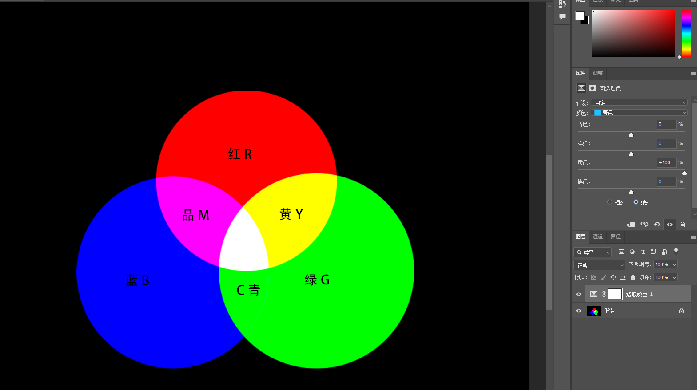
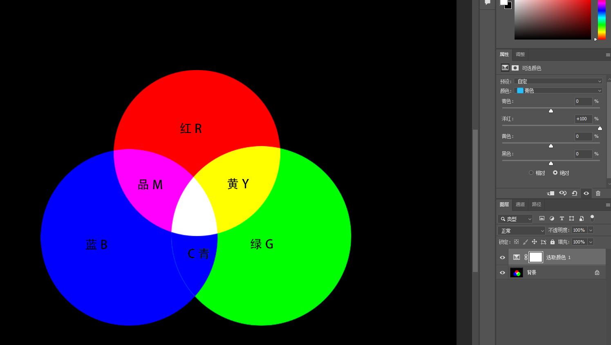
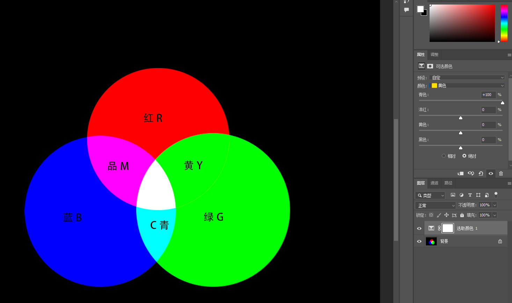
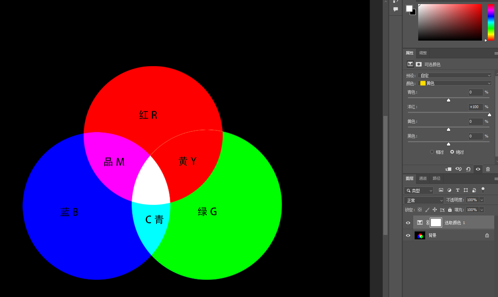
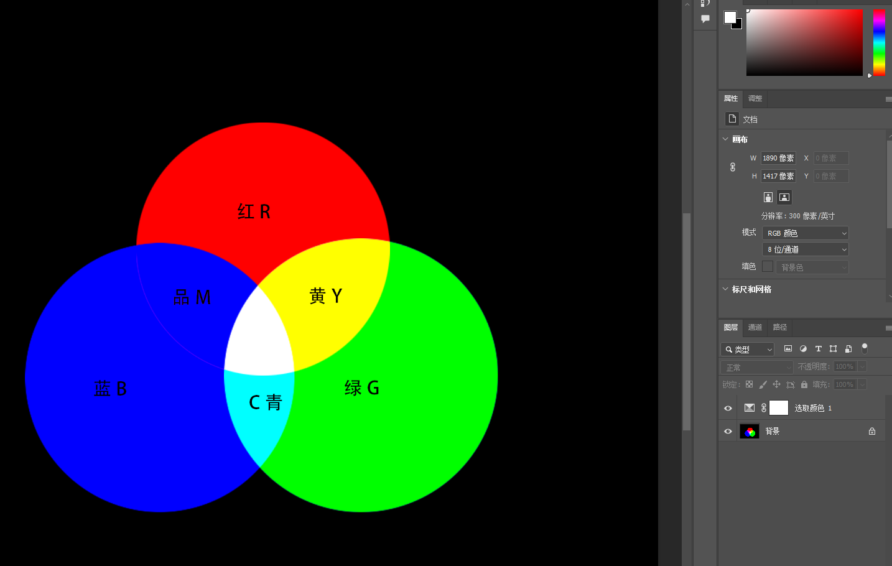
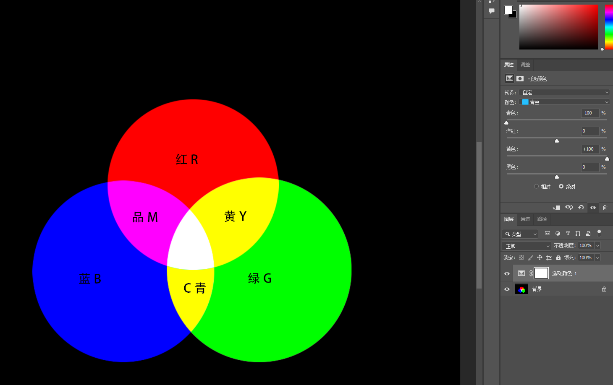
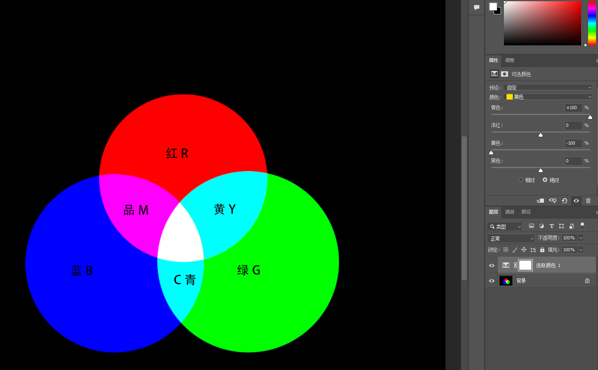
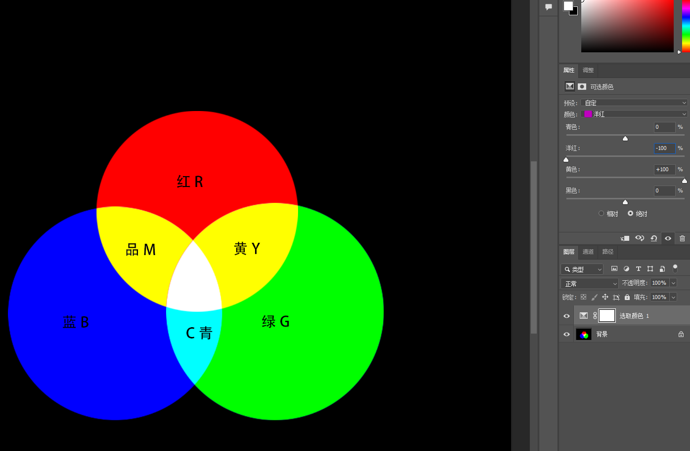

# LightRoom入门

## 1. 色彩原理

### 1.1 色温和色调
色温是由蓝色和黄色进行控制，色调是由绿色和洋红进行控制。需要通过互补色进行配合使用

| 名称（CMY色料三原色） |    组成色     |
| :----------: | :--------: |
|      红色      |   洋红 + 黄   |
|      绿色      |   黄 + 青    |
|      蓝色      |   青 + 洋红   |
|      黑色      | 青 + 洋红 + 黄 |

| 名称（RGB色光三原色） |    组成色    |
| :----------: | :-------: |
|      洋红      |   红 + 蓝   |
|      青色      |   绿 + 蓝   |
|      黄色      |   红 + 绿   |
|      白色      | 红 + 绿 + 蓝 |

### 1.2 互补色
两种颜色在色环上180°相对，类似两个极端，为补色相互调和会使色彩纯度降低，变成灰色

#### RGB颜色转换

###### 1. 青转绿
- 组合：蓝 + 绿
- 转换公式：主要目的是减蓝色，那么可以加互补色黄色

###### 2. 青转蓝
- 组合：蓝 + 绿
- 转换公式：主要目的是减去绿，那么增加绿色互补色洋红

###### 3. 黄转绿
- 组合：红 + 绿
- 转换公式：减去红色，增加互补色青色

###### 4. 黄转红
- 组合：红 + 绿
- 转换公式：减去绿色，增加互补色品红

##### 5. 品红转蓝
- 组合：红 + 蓝
- 转换公式：减去红色，增加红色互补色青色

##### 6. 青转黄
- 转换公式：先将青色转换为绿色（减去蓝色，增加蓝色互补色黄色），在将绿色转换为黄色（加上红色，减去红色的互补色青色）

##### 7. 黄转青
- 转换公式：将黄色转化为绿色（减去红色，增加红色互补色青色），在将绿色转换为黄色（加上蓝色，减去蓝色的互补色黄色）

##### 8. 品红转黄
- 转换公式：将品红转换红色（减去蓝色，增加蓝色互补色黄色），将红色转换为黄色（增加绿色，减去绿色互补色品红）

#### CMYK颜色转换

### 1.3 曝光
与白平衡相似，整体控制照片，提高照片的亮度

### 1.4 对比度
主要是控制明暗的对比反差，色彩的饱和度

|  设置   |          影响          |          什么时候调整           |
| :---: | :------------------: | :-----------------------: |
| 拉低对比度 | 照片的明暗对比降低、颜色之间的饱和度变低 | 画面中的明暗对比度太高了、颜色之间的饱和度也太高了 |
| 提高对比度 | 照片的明暗对比加高、颜色之间的饱和度变高 |     画面明暗对比度太低、颜色饱和度不够     |
### 1.5 直方图

从左到右分为5个部分，最暗的地方 -> 偏暗的地方 -> 偏灰的地方 -> 偏亮的地方 -> 最亮的地方

[^1]: 
